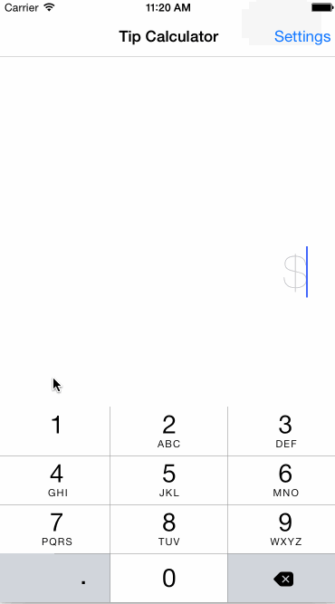

# tipcalculator

This is a Tip Calculator application for iOS submitted as the [pre-assignment](https://gist.github.com/timothy1ee/7747214) requirement for CodePath.

Time spent: 12 hrs

Completed:

* [x] Required: User can enter a bill amount, choose a tip percentage, and see the tip and total values.
* [x] Required: Settings page to change the default tip percentage
* [x] Optional: UI animations
* [x] Optional: Remembering the bill amount across app restarts
* [x] Optional: Using locale-specific currency and currency thousands separators
* [x] Optional: Making sure the keyboard is always visible and the bill amount is always the first responder. This way the user doesn't have to tap anywhere to use this app. Just launch the app and start typing.
* [x] Additional: Splitting bills for up to 4 people
* [x] Additional: Allow user to fine tune tip percentage after choosing common options
* [x] Additional: User can choose currency denomination at the settings page

Note: The video walkthrough is a simulation on iPhone 6 Potrait mode. I haven't tested it for other devices